# Objective
* 1. Assumption: Servers with OS are available
* 2. Goal: We need to deploy our application in the servers

# Configuration Management (CM)
* PULL and PUSH Based CM

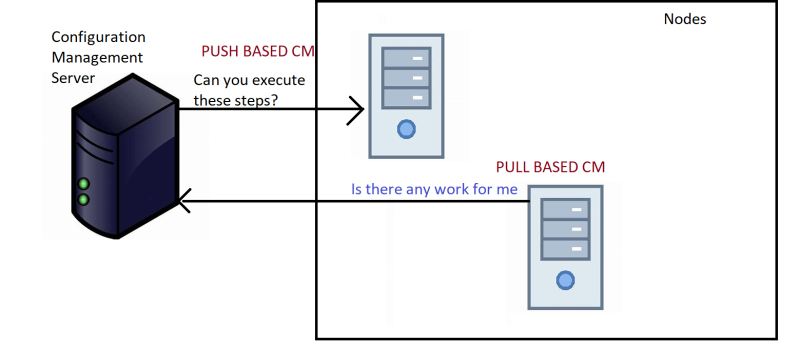

* PUSH BASED CM 
   * CM Server will initiate the connection, so it requires the ipaddress/name of the node
   * It will login into the Node and Execute the configuration. For this we need credentials of the node.
   * In this model the Configuration Management Server has to maintain ip address/names and credentials of the nodes.
   * Ansible is a Push Based CM implementations

* PULL BASED CM: 
   * Node will initiate the communication and ask for the configuration to be executed and when the CM Server Responds, it executes the configuration and shares the execution report (success/failure & some logs about what happended)
   * On the nodes a CM agent will be installed which is responsible for communication, execution and reporting
   * Chef/Puppet are Pull Based CM implementations

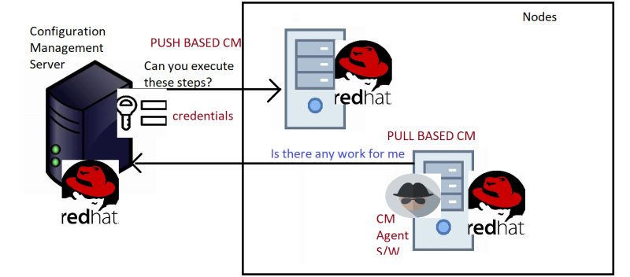

# Declartive vs Procedural Approach

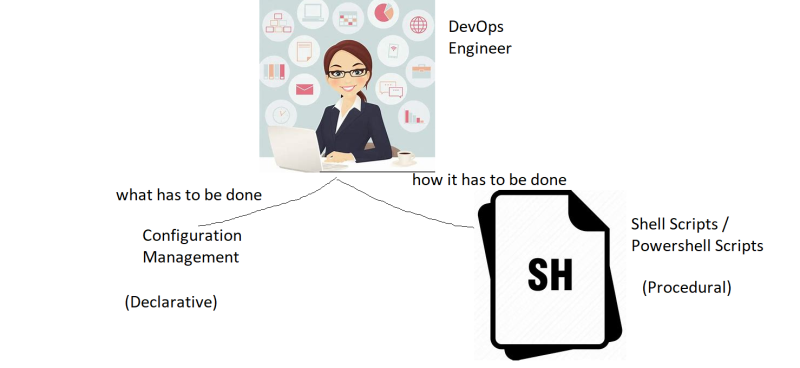

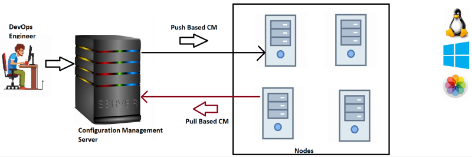

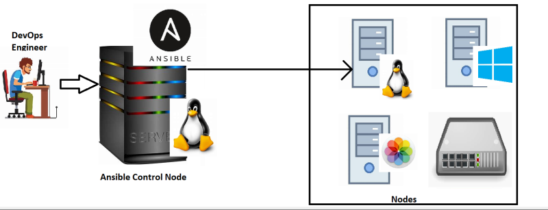

* Ansible is widely adopted for
    * Configuration Management
    * Network Automation
    * Administrative Activity Automation.

# How Ansible Works

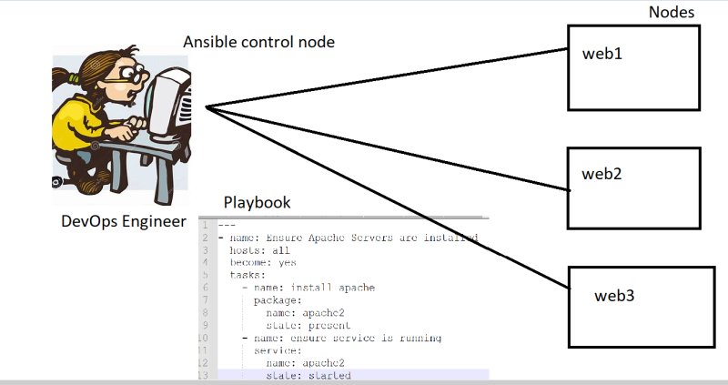

* Ansible should be installed on the control node which comes with inbuilt python or uses the existing python on the control node
* On the Nodes, we need to ensure python is installed.
* When we execute Ansible Playbook, Ansible control node logs in into nodes parallely (by default 5) and executes the playbook using python
* To login into the node Ansible needs credentials configured.
* Protocol used for logging into
    * Linux Machine: SSH
    * Windows Machine: WinRM

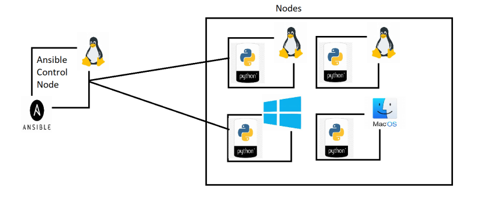

## Lab Setup
* We need 1 Linux Machine to act as Ansible Control Node
* Visual Studio Code as a editor.
* Windows 7 or 8.1 => Install Git on Windows

# Ansible Architecture

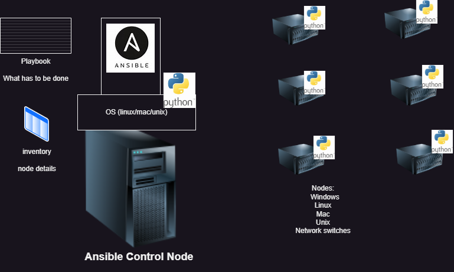

* Components
    * Ansible control node: This is where ansible is installed
    * Nodes: This is where we want o perform deployments
    * Inventory: list of nodes and their information
    * Playbook: What has to be done on the node

* Workflow
    * We develop playook and specify inventory and execute the playbook on ansible control node
    * Now ansible tries to establish connection to node
    * Now the ansible playbook is executed with the help of python on node.

* Authentication in Linux or Credentials
    * Linux uses SSH (Secure Shell) for connecting to other instances
    * There are two types of credentials
        * username and password
        * username and key pair

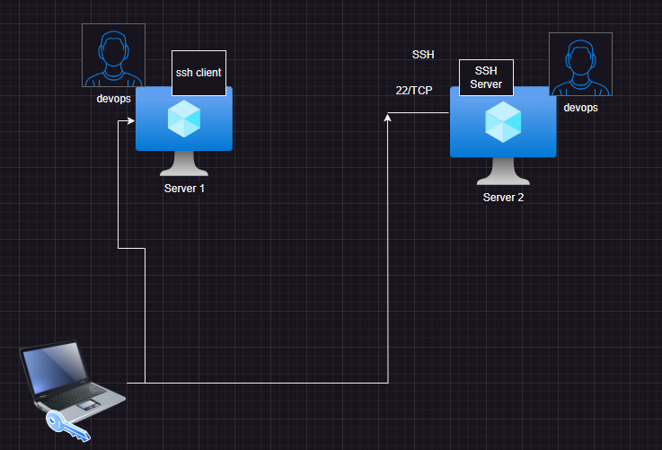

* We will create a user called as devops on server 1 and server 2
* Enable password based authentication
* Try to login from server 1 to server 2 using devops user

* Solution
    * Enable password based authentication
        * check the value of PasswordAuthentication in file ``` /etc/ssh/sshd_config ``` and change it to yes
        Restart sshd ```` sudo systemctl restart sshd ```
    * Create a user called as ``` devops ```

    ```
    sudo adduser devops
    ```
    
    * Now repeat the above steps on server 2
    * Now from server 1 connect to server2 ``` ssh devops@<server2-ip> ```

* Setting up password less authentication between linux machines
    * We have two servers with user ``` devops ```
    * From server1 create a key pair

``` ssh-keygen ```

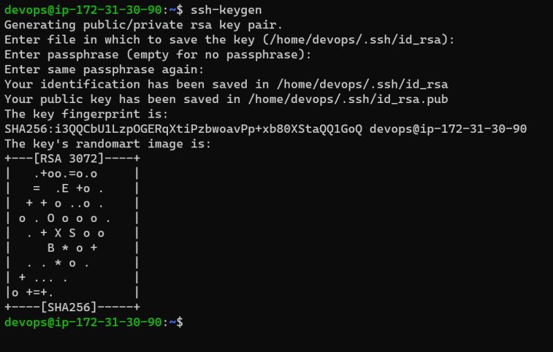

* Now copy the public key into server 2 ``` ssh-copy-id <username>@<server-2-ip> ```
* After the ssh-copy-id is success, then we can login directly by using ip address as both machines have same username and password less authentication is setup

```
ssh <server-2-ip>
```

## Ansible setup
* We have two machines with common user ``` devops ``` with sudo permissions and password less authentication setup between server 1 and server 2
* From now server 1 will be called as ``` Ansible Control node ```
    and server 2 as ``` node 1 ```
* Ensure python 3 is installed
* [Refer Here](https://docs.ansible.com/ansible/latest/installation_guide/index.html) for installation guide
* We have two approaches to install ansible
    * using python
    * using package managers like apt or yum (dnf)
* [Refer Here](https://docs.ansible.com/ansible/latest/installation_guide/installation_distros.html#installing-ansible-on-ubuntu) for ubuntu specific installation.

```
sudo apt update
sudo apt install software-properties-common
sudo add-apt-repository --yes --update ppa:ansible/ansible
sudo apt install ansible -y
ansible --version
```
* Overview

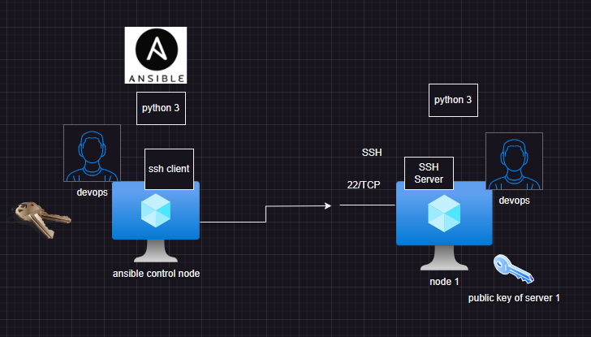


# Test ansible connectivity from ansible control node to node 1

* Create a file with node 1 ip address in it

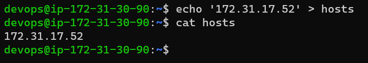

* execute the following command ``` ansible -m ping -i hosts all ```

# Adding users to sudo

* [Refer Here](https://linuxize.com/post/how-to-add-user-to-sudoers-in-ubuntu/) for debian based systems
* [Refer Here](https://developers.redhat.com/blog/2018/08/15/how-to-enable-sudo-on-rhel) for redhat based systems
* In this case we will be editing sudoers file directly

```
sudo visudo
```

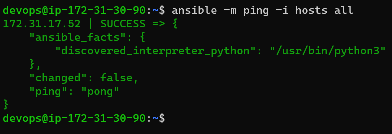


