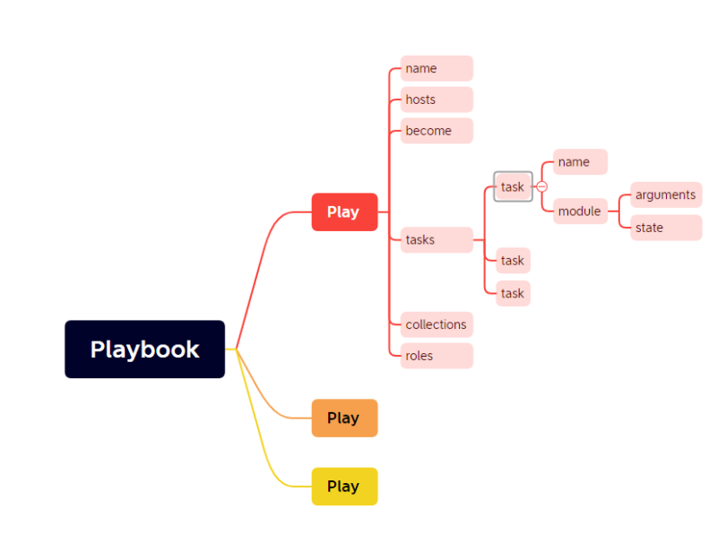
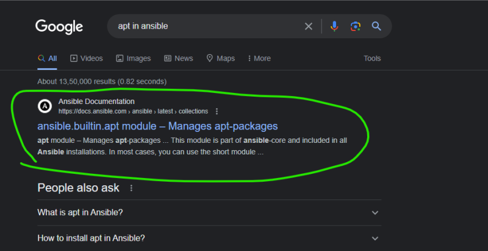
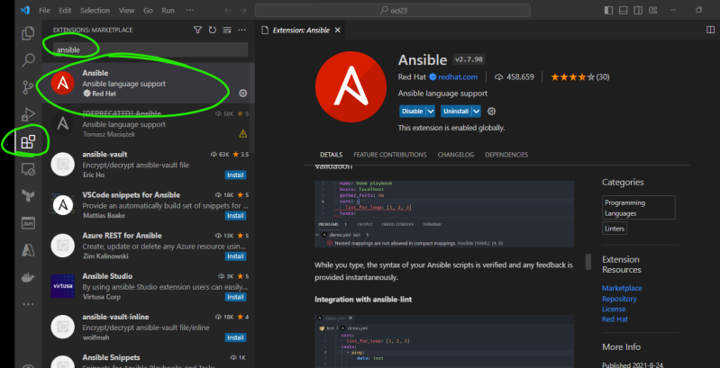
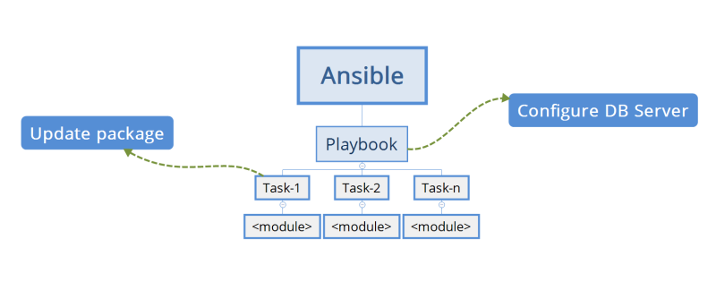

# YAML
* This is data representation language which uses name values

```
<name>: <value>
```

* YAML is inspired from python, so indentation’s become mandatory
* YAML files generally have .yaml or .yml as extensions
* [Refer Here](https://docs.ansible.com/ansible/latest/reference_appendices/YAMLSyntax.html) for YAML syntax

*  Basic structure of Ansible playbook

```yml
---
- name: <name of playbook - text>
  hosts: <where to execute-text>
  become: <need sudo permissions -bool>
  tasks: # <list of task>
  - name: Ensure apache is at the latest version # name of task
    ansible.builtin.yum: # module name
      name: httpd # module arguments
      state: latest # state

```

* Ansible Playbook structure



# Lets create a simple playbook

* Goal: create a file @ /tmp/1.txt
* manual:

```
touch /tmp/1.txt
```
* where to execute: all machines
* Approximate playbook

```yml
---
- name: create file play
  become: false
  hosts: all
  tasks:
    - name: create file
      ansible.builtin.file:
        path: '/tmp/1.txt'
        state: touch
```

* Real-Life Example

```yml
---
- hosts: home
  become: yes
  tasks:
    - name: to bring a vegetables from market
      dmart:
       - tomato
       - potato
       - onion
    - name: to purchase a kurtha
      cmr:
        - kurtha
        - hoodie
```

# Ways of Working in Ansible
* Figure out the manual steps
* Execute and verify if they are working
* for each manual step findout an ansible module which can help

# Ansible Module
* this is the smallest unit of work in Ansible
* Module takes some inputs which are generally referred as parameters and it has state
* Ansible modules [Refer Here](https://docs.ansible.com/ansible/2.9/modules/list_of_all_modules.html)

# Ansible Execution Approaches
* Adhoc command: This uses the following structure and it is used for non repetitive tasks

```
ansible -m "<module-name>" -a "<arguments>" <where>
```
* Playbook: This is yaml representation of sequence of commands and it is designed to be reptitive.

# Activity: install apache server on node 1
*  manual steps: [Refer Here](https://www.digitalocean.com/community/tutorials/how-to-install-the-apache-web-server-on-ubuntu-22-04)

```
sudo apt update
sudo apt install apache2 -y
```
* Finding modules



* Dev Env: Use Visual studio code and install ``` ansible ``` extension from Redhat



* Playbook & Inventory provided below

```yml
---
- name: activity 1
  become: yes
  hosts: all
  tasks:
    - name: install apache server
      ansible.builtin.apt:
        name:
          - apache2
        state: present
        update_cache: yes
```
* Inventory

```
172.31.17.52
```

* Syntax check

```
ansible-playbook --syntax-check -i <path to inventory> <path to playbook.yaml>
ansible-playbook --syntax-check -i hosts activity1.yaml
```

* Check the execution (dry run). Note this is not always correct

```
ansible-playbook --check -i <path to inventory> <path to playbook.yaml>
ansible-playbook --check -i hosts activity1.yaml
```


# Activity 2: Install php on apache server
* Manual steps: [Refer Here](https://www.digitalocean.com/community/tutorials/how-to-install-linux-apache-mysql-php-lamp-stack-on-ubuntu-22-04) for getting the steps

```
sudo apt udpate 
sudo apt install apache2 -y
sudo apt install php libapache2-mod-php php-mysql -y
```

* Lets create a file ``` /var/www/html/info.php ``` with the following content

```
<?php phpinfo(); ?>
```
* Now access ``` http://publicip/info.php ```

* Playbook & Inventory provided below

```yml
---
- name: activity 2 - install php
  become: yes
  hosts: all
  tasks:
    - name: install apache and php package
      ansible.builtin.apt:
        name:
          - apache2
          - php 
          - libapache2-mod-php 
          - php-mysql
        update_cache: yes
        state: present
    - name: copy php file
      ansible.builtin.copy:
        src: info.php
        dest: /var/www/html/info.php
```
* php file to copy

```php
<?php phpinfo(); ?>
```
* Inventory (hosts)

```
172.31.17.52
```
